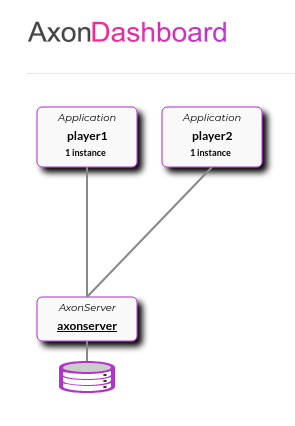

# Add Divide Game

The application consists of the following components:

* 1 Axon server that acts as the Event storage
* 2 Players (Game server) which start independently and connect to the Axon server
* 1 Database for Axon tracking event processing



## Concepts used

* DDD
* CQRS
* Event sourcing
* Reactive programming

## Logic

1. Player1 starts the game with an `CreateGameCommand`
2. `GameCreatedEvent` is generated and updates the `GameAggregate`
3. Immediately player1 makes a "move" with a `PlayCommand`
4. `PlayEvent` is generated which updates the `GameAggreate`
5. `NextMoveEvent` is generated
6. Nothing happens until player2 is online
7. Player2 is online and handles `NextMoveEvent`, generating a `PlayEvent`
8. Repeats from step 4, until there is a Winner
9. `GameFinishedEvent` is fired, and game is ends

If at any moment any player loses connection, nothing happens until it is back online.
Events will be replayed when the player goes online, and will continue the game.


## Tools used

* Gradle as build tool
* Docker compose: for DB and Event storage
* Axon framework: for event sourcing
* Axon server: for event storage
* Postgresql: for Axon tracking token
* Spring Webflux with functional endpoints: for rest application

---

## Requisites

* Docker, docker compose
* Java 11
---

## Start Services: Axon server(event storage), Postgresql

Go to the `docker` directory and execute:
```
docker-compose up
```

Axon provides a visual overview of the application status, for this you can see the state of the application, services connected and events at:

`localhost:8024`

To terminate and remove services:
```
docker-compose down
```

---

## Start application

For this implementation there are 2 profiles(with yaml properties files) for each player. We can think of them as 2 services.
It is possible to adjust port configuration or other details in the configuration files.

To start each service with a profile set the profile flag to one of these values:
* player1
* player2

If using IntelliJ it is possible to set this value on `Edit configuration` > `Active Profiles`

If using the terminal, go to the root of the project, use the following command for player1:
```
java -jar game-server/build/libs/game-server-game-0.0.1-SNAPSHOT.jar --spring.profiles.active=player1
```

For player2:
```
java -jar game-server/build/libs/game-server-game-0.0.1-SNAPSHOT.jar --spring.profiles.active=player2
```
---

## Endpoints

After starting all the components of the application the following endpoints should be available:

### Axon Server

Axon server with UI about the Event storage:
http://localhost:8024/

### Players endpoints 

* Port for player1: 8050, see [application-player1.yml](./game-server/src/main/resources/application-player1.yml)
* Port for player1: 8060, see [application-player2.yml](./game-server/src/main/resources/application-player2.yml)

### Automatic mode(random input):
`localhost:{port}/game/auto`

### Manual mode:
`localhost:{port}/game/manual`

Payload example:
```
{
    "initialValue": 56
}

```
---

### Things to improve/add

* Add Api documentation (OpenApi3)
* Dockerize all components
* Tests for all logic
* Add test coverage
* Validation of inputs
* Exception handling
* Separation of Player into its own service with own Aggregate 
* Save all games in the DB
* Add 'query' side operations to check for different games
* Registration of players into the system with DB
* Repository for saving users state, registration
* Use of snapshots for Event replay


